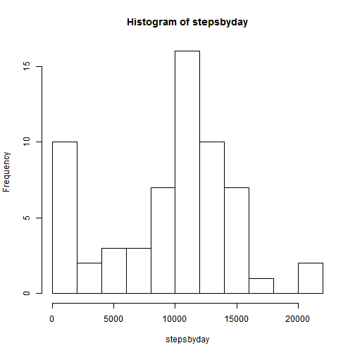
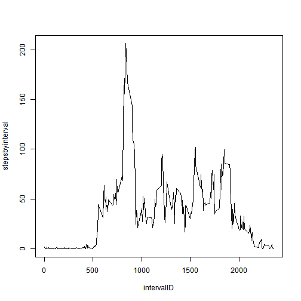
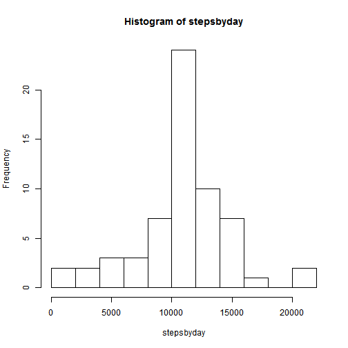
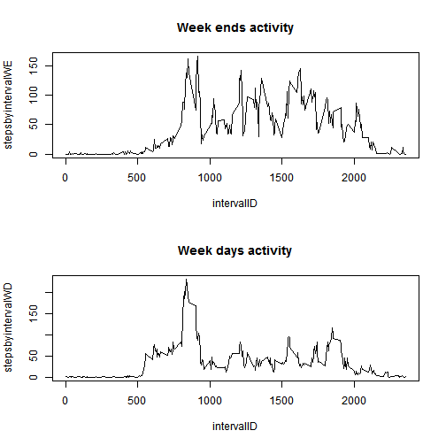

## Objective
To demonstrate a working knowledge of Literate (Statistical) Programming
using R Markdown 

## Loading and preprocessing the data

```r
activity <- read.csv("activity.csv")
str(activity)
```

```
## 'data.frame':	17568 obs. of  3 variables:
##  $ steps   : int  NA NA NA NA NA NA NA NA NA NA ...
##  $ date    : Factor w/ 61 levels "2012-10-01","2012-10-02",..: 1 1 1 1 1 1 1 1 1 1 ...
##  $ interval: int  0 5 10 15 20 25 30 35 40 45 ...
```

```r
summary(activity)
```

```
##      steps                date          interval     
##  Min.   :  0.00   2012-10-01:  288   Min.   :   0.0  
##  1st Qu.:  0.00   2012-10-02:  288   1st Qu.: 588.8  
##  Median :  0.00   2012-10-03:  288   Median :1177.5  
##  Mean   : 37.38   2012-10-04:  288   Mean   :1177.5  
##  3rd Qu.: 12.00   2012-10-05:  288   3rd Qu.:1766.2  
##  Max.   :806.00   2012-10-06:  288   Max.   :2355.0  
##  NA's   :2304     (Other)   :15840
```

Here you can see there are 17,568 observations and 2304 of them are NA's or
about 13%.  
The number of observations per day seems complete (288), i.e.: there are no
days with missing records, although there are NA's.  
Do missing values correspond to complete days? This question will be addressed
later.  
It is somehow disturbing that the interval value goes up to 2355 if 288*5 
is 1440, so let's see the first and last 15 records.


```r
head(activity,15)
```

```
##    steps       date interval
## 1     NA 2012-10-01        0
## 2     NA 2012-10-01        5
## 3     NA 2012-10-01       10
## 4     NA 2012-10-01       15
## 5     NA 2012-10-01       20
## 6     NA 2012-10-01       25
## 7     NA 2012-10-01       30
## 8     NA 2012-10-01       35
## 9     NA 2012-10-01       40
## 10    NA 2012-10-01       45
## 11    NA 2012-10-01       50
## 12    NA 2012-10-01       55
## 13    NA 2012-10-01      100
## 14    NA 2012-10-01      105
## 15    NA 2012-10-01      110
```

```r
tail(activity,15)
```

```
##       steps       date interval
## 17554    NA 2012-11-30     2245
## 17555    NA 2012-11-30     2250
## 17556    NA 2012-11-30     2255
## 17557    NA 2012-11-30     2300
## 17558    NA 2012-11-30     2305
## 17559    NA 2012-11-30     2310
## 17560    NA 2012-11-30     2315
## 17561    NA 2012-11-30     2320
## 17562    NA 2012-11-30     2325
## 17563    NA 2012-11-30     2330
## 17564    NA 2012-11-30     2335
## 17565    NA 2012-11-30     2340
## 17566    NA 2012-11-30     2345
## 17567    NA 2012-11-30     2350
## 17568    NA 2012-11-30     2355
```

Ok! The interval is formed by four digits. The first two correspond to the
"hour" and the other two correspond to the minute, which actually is recorded
every five minutes (or twelve times in an hour). Records 0:12 correspond to
hour 0, records 13:25 to hour 1, and so on.

So, the interval has to be "cleaned" making it a uniform 4 character string 
(padding with ceros to the left and extracting the four rightmost characters)
   

```r
library(stringr)
activity$interval <- str_sub(paste("000", activity$interval, sep=""),-4)
```

## What is mean total number of steps taken per day?
This question can be easily answered determining the total number of steps
each day, and then obtain basic statistics.


```r
stepsbyday <- tapply(activity$steps, activity$date, sum, na.rm=TRUE)
summary(stepsbyday)
```

```
##    Min. 1st Qu.  Median    Mean 3rd Qu.    Max. 
##       0    6778   10400    9354   12810   21190
```

So we get the **mean is 9,354** steps per day and the **median is 10,400**
steps per day, and some days have cero steps recorded.


```r
stepsbyday[stepsbyday==0]
```

```
## 2012-10-01 2012-10-08 2012-11-01 2012-11-04 2012-11-09 2012-11-10 
##          0          0          0          0          0          0 
## 2012-11-14 2012-11-30 
##          0          0
```

In fact, 8 days have 0 steps recorded and it makes sense. It will be very
rare to have missing values inside a day... and validating 8*288 is 2,304
or the total number of missing values.

A histogram of the steps by day follows, which shows a frequency of less
than 10 for cero steps and a couple of days with a very big number of steps... 

```r
hist(stepsbyday, breaks=10)
```

 

## What is the average daily activity pattern?

For this question, I calculated the average number of steps per time 
interval, across all days and created a vector for unique interval 
identifications. 

The plot to show the average daily activity pattern follows.

```r
stepsbyinterval <- tapply(activity$steps, activity$interval, mean, na.rm=TRUE)
intervalID <- unique(activity$interval)
plot(intervalID, stepsbyinterval,type="l")
```

 

Looking at the plot we can see that the 5-minute interval, on average across
all the days in the dataset, that contains the maximum number of steps is 
around 800 and 900, so, which one is it exactly? Easy, select the 
intervalID which has the largest stepsbyinterval value


```r
intervalID[stepsbyinterval==max(stepsbyinterval)]
```

```
## [1] "0835"
```

And now we are shure, it is 8:35. **Walking to work?** 
 
## Imputing missing values

As has been said before the total number of missing values is 2304, and it
can be easily confirmed:


```r
sum(is.na(activity$steps))
```

```
## [1] 2304
```

With all this knowledge, I think the best strategy for imputing missing
values is to use the mean steps by interval across all dates, value which 
has already been calculated. 


```r
## Imputate average steps by interval to missing values
## Use only integer steps
for (i in c(1:nrow(activity))) {
	if (is.na(activity$steps[i])) {
		activity$steps[i] <- as.integer(
			stepsbyinterval[intervalID==activity$interval[i]])}
	}
	
## Create a new dataset without missing values
write.csv(activity, "activityNoNA.csv",row.names=FALSE)
stepsbyday <- tapply(activity$steps, activity$date, sum, na.rm=TRUE)
summary(stepsbyday)
```

```
##    Min. 1st Qu.  Median    Mean 3rd Qu.    Max. 
##      41    9819   10640   10750   12810   21190
```

```r
hist(stepsbyday, breaks=10)
```

 

From the graph and the summary, you can see the mean and the median have got
closer together and is follows a clearer "normal" distribution.

## Are there differences in activity patterns between weekdays and weekends?

For this question, I created a factor identifying weekdays and weekend days,
and build a plot showing the data split by that factor.
     

```r
## This code uses locale information, so make shure we are using US locale
Sys.setlocale("LC_TIME","us")
```

```
## [1] "English_United States.1252"
```

```r
activity$day <- "weekday"
weekend <- weekdays(as.Date(activity$date),abbreviate=TRUE)	%in% c("Sat","Sun")
activity$day[weekend] <- "weekend"
activity$day <- as.factor(activity$day)

## Make the graph
par(mfrow = c(2,1))
stepsbyintervalWE <- tapply(activity$steps[activity$day=="weekend"], 
					activity$interval[activity$day=="weekend"],
					mean, na.rm=TRUE)
plot(intervalID, stepsbyintervalWE, type="l", main="Week ends activity") 
stepsbyintervalWD <- tapply(activity$steps[activity$day=="weekday"], 
					activity$interval[activity$day=="weekday"],
					mean, na.rm=TRUE)
plot(intervalID, stepsbyintervalWD, type="l", main="Week days activity")
```

 

During the week days walking activity diminishes from around 9:30 to
around 17:00. **Seems the subject is actually working!**  
During weekends there is a lot of walking activity all day round, except 
around 15:00, **maybe having lunch?** and certainly, going to sleep later...
