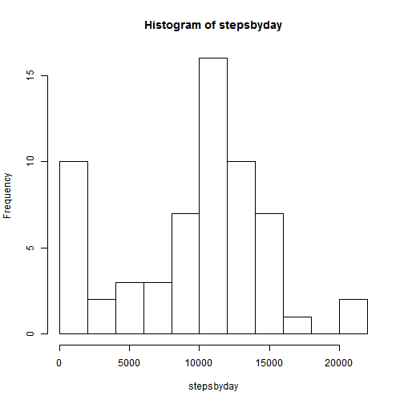
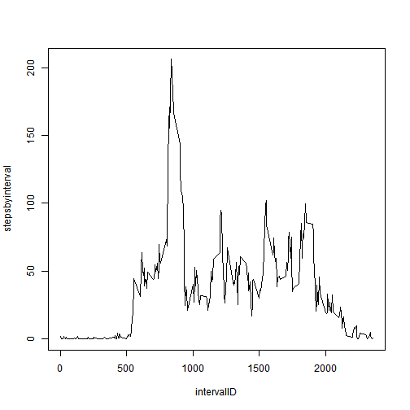
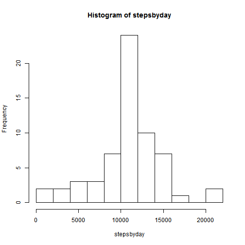

## Objective
To demonstrate a working knowledge of Literate (Statistical) Programming
using R Markdown 

## Loading and preprocessing the data
First thing we should do after reading data is try to understand it.


```r
activity <- read.csv("activity.csv")
str(activity)
```

```
## 'data.frame':	17568 obs. of  3 variables:
##  $ steps   : int  NA NA NA NA NA NA NA NA NA NA ...
##  $ date    : Factor w/ 61 levels "2012-10-01","2012-10-02",..: 1 1 1 1 1 1 1 1 1 1 ...
##  $ interval: int  0 5 10 15 20 25 30 35 40 45 ...
```

```r
summary(activity)
```

```
##      steps                date          interval     
##  Min.   :  0.00   2012-10-01:  288   Min.   :   0.0  
##  1st Qu.:  0.00   2012-10-02:  288   1st Qu.: 588.8  
##  Median :  0.00   2012-10-03:  288   Median :1177.5  
##  Mean   : 37.38   2012-10-04:  288   Mean   :1177.5  
##  3rd Qu.: 12.00   2012-10-05:  288   3rd Qu.:1766.2  
##  Max.   :806.00   2012-10-06:  288   Max.   :2355.0  
##  NA's   :2304     (Other)   :15840
```

Here we can see there are 17,568 observations and 2304 of them are NA's or
about 13%.  
Also we know we will have to "fix" the date so it is in a usable format.  
The number of observations per day is complete (288), i.e.: there are no
days with missing records, although there are NA's.  
A question that will be answered later is: are missing values inside any 
given day or missing values correspond to complete days?  
It is somehow disturbing that the interval value goes up to 2355
(288*5 is 1440) and it can be explained by looking at the first 15 records.


```r
head(activity,15)
```

```
##    steps       date interval
## 1     NA 2012-10-01        0
## 2     NA 2012-10-01        5
## 3     NA 2012-10-01       10
## 4     NA 2012-10-01       15
## 5     NA 2012-10-01       20
## 6     NA 2012-10-01       25
## 7     NA 2012-10-01       30
## 8     NA 2012-10-01       35
## 9     NA 2012-10-01       40
## 10    NA 2012-10-01       45
## 11    NA 2012-10-01       50
## 12    NA 2012-10-01       55
## 13    NA 2012-10-01      100
## 14    NA 2012-10-01      105
## 15    NA 2012-10-01      110
```

Ok! the interval is formed by four digits. The first two correspond to the
"hour" and the other two correspond to the minute, which actually is recorded
every five minutes (or twelve times in an hour). Records 0:12 correspond to
hour 0, records 13:25 to hour 1, and so on.

Now we should perform some cleaning of the data, preparing it for further use, 
specifically we have to make the interval a uniform 4 character string 
(padding with ceros to the left and extracting the four rightmost characters)
   

```r
library(stringr)
activity$interval <- str_sub(paste("000", activity$interval, sep=""),-4)
```

## What is mean total number of steps taken per day?
To answer this question first we determine the total number of steps each day,
and then obtain basic statistics.


```r
stepsbyday <- tapply(activity$steps, activity$date, sum, na.rm=TRUE)
summary(stepsbyday)
```

```
##    Min. 1st Qu.  Median    Mean 3rd Qu.    Max. 
##       0    6778   10400    9354   12810   21190
```

So we observe the **mean is 9,354** steps per day and the **median is 10,400**
steps per day.

Now we can answer the question previously stated. Which dates have 0 steps
recorded?

```r
stepsbyday[stepsbyday==0]
```

```
## 2012-10-01 2012-10-08 2012-11-01 2012-11-04 2012-11-09 2012-11-10 
##          0          0          0          0          0          0 
## 2012-11-14 2012-11-30 
##          0          0
```

We can see 8 days have 0 steps recorded and it makes sense. It will be very
rare to have missing values inside a day... and validating 8*288 is 2,304
or the total number of missing values.

An histogram of the steps by day follows, which shows a frequency of lest
than 10 for cero steps and a couple of days with a very big number of steps... 

```r
hist(stepsbyday, breaks=10)
```

 

## What is the average daily activity pattern?

For this question, we need to calculate the average number of steps per time 
interval, across all days. We also need to create a vector for unique 
interval identifications. 

Then we can generate a plot to show the average daily activity pattern.

```r
stepsbyinterval <- tapply(activity$steps, activity$interval, mean, na.rm=TRUE)
intervalID <- unique(activity$interval)
plot(intervalID, stepsbyinterval,type="l")
```

 

Looking at the plot we can see that the 5-minute interval, on average across
all the days in the dataset, that contains the maximum number of steps is 
around 800 and 900, so, which one is it exactly? We have to select the 
intervalID which has the largest stepsbyinterval value


```r
intervalID[stepsbyinterval==max(stepsbyinterval)]
```

```
## [1] "0835"
```

And now we are shure, it is 8:35. **Walking to work?** 
 
## Imputing missing values

As has been said before the total number of missing values is 2304, and we can
confirm it very easily:


```r
sum(is.na(activity$steps))
```

```
## [1] 2304
```

After all we have learned with the previous questions, I think the best 
strategy for imputing missing values is to use the mean steps by interval
across all dates, value which we have already calculated. 


```r
for (i in c(1:nrow(activity))) {
	if (is.na(activity$steps[i])) {
		activity$steps[i] <- 
			stepsbyinterval[intervalID==activity$interval[i]]}
	}

## Create a new dataset without missing values
```

```r
write.csv(activity,"activityNEW.csv",row.names=FALSE)
stepsbyday <- tapply(activity$steps, activity$date, sum, na.rm=TRUE)
summary(stepsbyday)
```

```
##    Min. 1st Qu.  Median    Mean 3rd Qu.    Max. 
##      41    9819   10770   10770   12810   21190
```

```r
hist(stepsbyday, breaks=10)
```

 

## Are there differences in activity patterns between weekdays and weekends?
